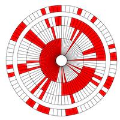

The parachute the Perseverance rover descended to Mars on, February 18, 2021, included a message that was decoded by several internet slueths after video from the landing was shared by JPL at a Feb 22, 2021 press conference.  This code demonstrates how that encoding works.

```
0000100 0000001 0010010 0000101 
   4       1      18       5    
   D       A       R       E    
0001101 0001001 0000111 0001000 0010100 0011001 
  13       9       7       8      20      25    
   M       I       G       H       T       Y    
0010100 0001000 0001001 0001110 0000111 0010011 
  20       8       9      14       7      19    
   T       H       I       N       G       S    
   
0100010 0001011 0111010 0001110 1110110 0001010 0011111 0010111 
                          14                              23    
  34      11      58       N      118     10      31       W    
```

To create your own:
```
design a JPL parachute

positional arguments:
  message       message to encode (4 words, each 8 or fewer charactrs)

optional arguments:
  -h, --help    show this help message and exit
  -white WHITE  hex color for white panels (default #FFF)
  -red RED      hex color for red panels (default #F00)
```
Example:
create_parachute.py DARE MIGHTY THINGS 34 11 58 N 118 10 31 W
